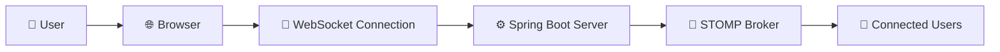

<div align="center">

# 💬 Real-Time Chat Application

### 🚀 Connect • Chat • Communicate Instantly

A modern real-time messaging platform built with **Spring Boot**, **WebSocket**, **STOMP**, and **Thymeleaf**, enabling seamless communication between multiple users without page refreshes.

<br>


<br>

### 🌟 Real-Time Messaging Experience Powered by Spring Boot

</div>

---

# 📖 About The Project

In today's digital world, real-time communication is essential. This project demonstrates how modern chat systems work by leveraging **WebSockets** and **STOMP Protocol** to create persistent client-server connections.

Users can join a chat room, exchange messages instantly, and receive live updates without refreshing the page.

> 💡 This project showcases practical backend development skills, real-time communication concepts, Spring ecosystem expertise, and frontend-backend integration.

---

# ✨ Key Features

<table>
<tr>
<td width="50%">

### 🚀 Real-Time Communication

* Instant message delivery
* WebSocket-based architecture
* Live user interaction
* Event-driven messaging

</td>

<td width="50%">

### 💬 Smart Chat Features

* Join notifications
* Leave notifications
* Dynamic message updates
* Multi-user support

</td>
</tr>

<tr>
<td>

### 🎨 Modern UI

* Responsive design
* Clean user interface
* Mobile-friendly layout
* Interactive experience

</td>

<td>

### ⚙️ Backend Power

* Spring Boot Architecture
* STOMP Messaging
* MVC Pattern
* Scalable Structure

</td>
</tr>
</table>

---

# 🏗️ System Architecture



---

# 🛠️ Tech Stack

<div align="center">

| Technology     | Purpose                   |
| -------------- | ------------------------- |
| ☕ Java 17      | Core Programming Language |
| 🍃 Spring Boot | Backend Framework         |
| 🔌 WebSocket   | Real-Time Communication   |
| 📡 STOMP       | Messaging Protocol        |
| 🌿 Thymeleaf   | Server-Side Rendering     |
| 🎨 HTML/CSS    | User Interface            |
| ⚡ JavaScript   | Dynamic Interaction       |
| 📦 Maven       | Dependency Management     |

</div>

---

# 📸 Application Preview

## 🔹 Join Chat Room


<br>

## 🔹 Real-Time Chat Interface


---

# ⚡ Project Workflow

```text
👤 User Enters Username
          │
          ▼
🔌 WebSocket Connection Established
          │
          ▼
📨 Message Sent Using STOMP
          │
          ▼
⚙️ Spring Boot Processes Message
          │
          ▼
📡 Message Broadcasted
          │
          ▼
👥 All Connected Users Receive Message Instantly
```

---

# 📂 Project Structure

```bash
src
├── main
│
├── java
│   ├── config
│   ├── controller
│   ├── model
│   └── ChatApplication.java
│
├── resources
│   ├── static
│   │   ├── css
│   │   └── js
│   │
│   ├── templates
│   │   └── chat.html
│   │
│   └── application.properties
│
└── pom.xml
```

---

# 🚀 Getting Started

### Clone Repository

```bash
git clone https://github.com/shashankpandey29/Real-Time-Chat-App.git
```

### Navigate to Project

```bash
cd Real-Time-Chat-App
```

### Run Application

```bash
mvn spring-boot:run
```

### Open Browser

```bash
http://localhost:8081
```

---

# 🎯 Skills Demonstrated

✅ Spring Boot Development

✅ RESTful Backend Concepts

✅ WebSocket Integration

✅ STOMP Messaging

✅ MVC Architecture

✅ Real-Time Communication

✅ Frontend-Backend Integration

✅ Java Application Development

✅ Maven Build Management

---

# 💼 Resume Impact

### Key Achievements

🔹 Developed a real-time chat application enabling instant communication among multiple users.

🔹 Implemented WebSocket and STOMP protocol for efficient message broadcasting.

🔹 Designed a responsive chat interface using Thymeleaf, HTML, CSS, and JavaScript.

🔹 Built a scalable Spring Boot backend following industry best practices.

🔹 Enhanced understanding of real-time systems and event-driven architecture.

---

# 🔮 Future Improvements

* 🔐 User Authentication & Authorization
* 👤 Private Messaging
* 📂 File Sharing
* 😀 Emoji Support
* 🟢 Online/Offline Status
* 📜 Chat History Storage
* 👥 Group Chats
* 📱 Mobile Optimization

---

# 👨‍💻 Developer

<div align="center">

## Shashank Pandey

### Java Developer | Spring Boot Developer | Backend Engineer

💼 Passionate about building scalable backend applications and real-time systems.

🔗 GitHub: https://github.com/shashankpandey29

🔗 LinkedIn: https://www.linkedin.com/in/shashank-pandey-170a25296

</div>

---

<div align="center">

## ⭐ If you like this project, give it a Star ⭐

### 🚀 Built with Spring Boot • WebSocket • STOMP • Thymeleaf

#### "Real-Time Communication Made Simple"

</div>

